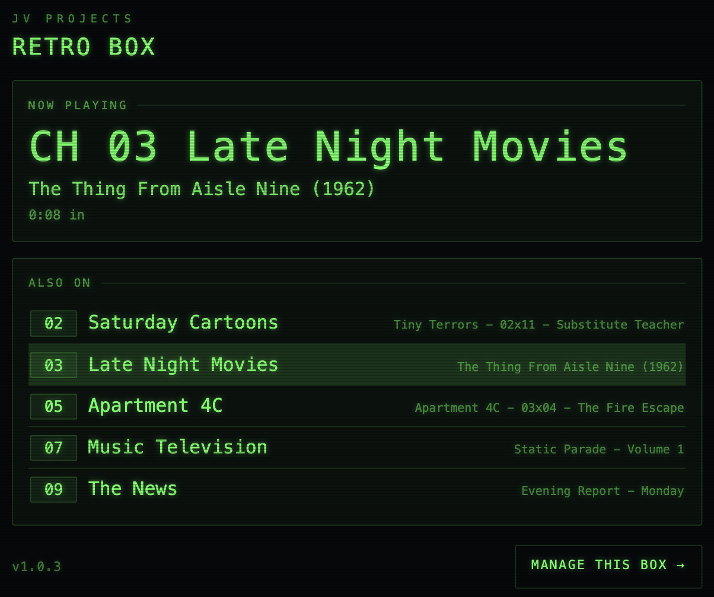
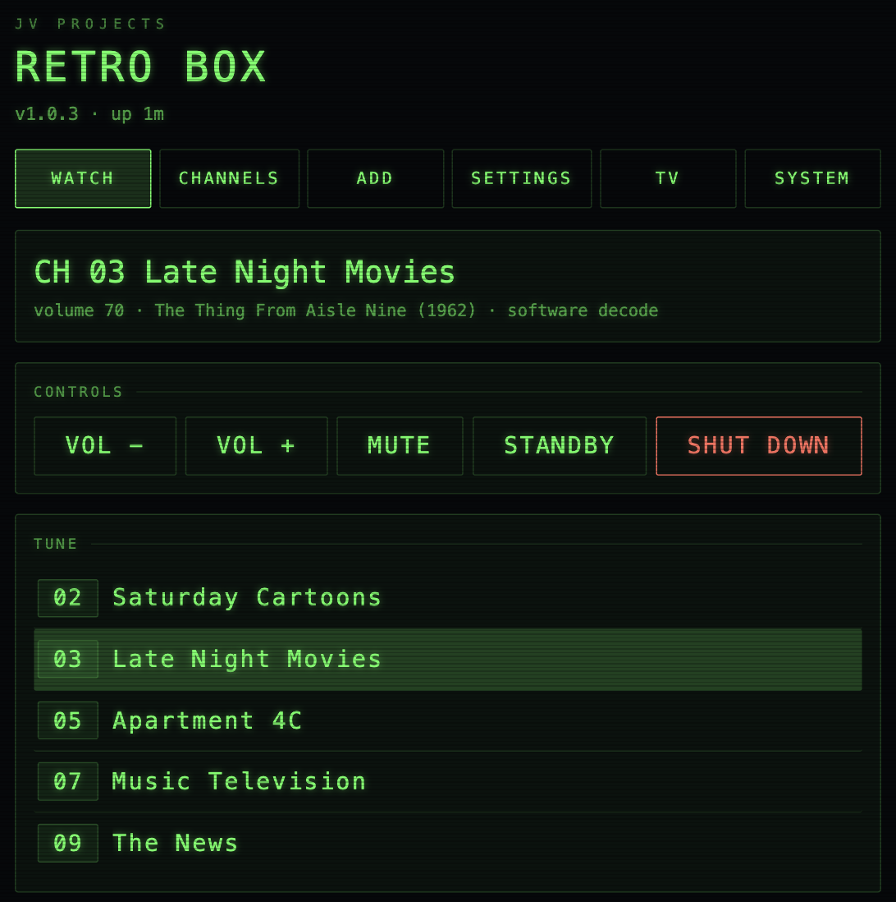
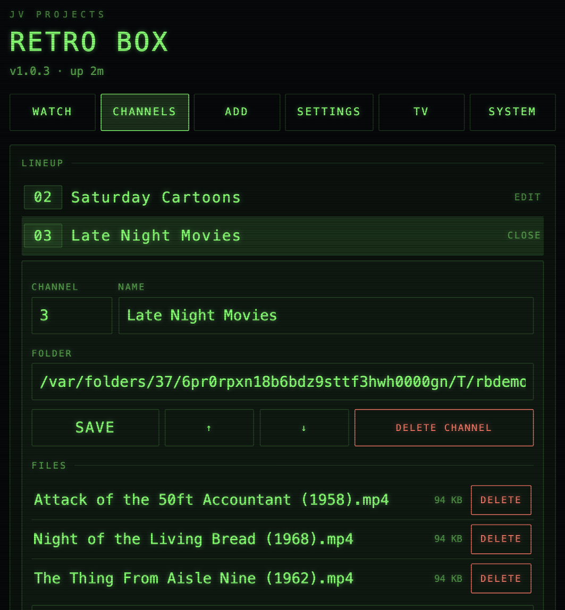
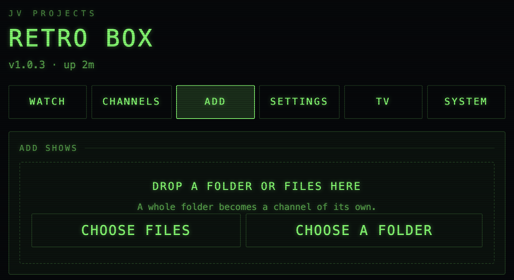
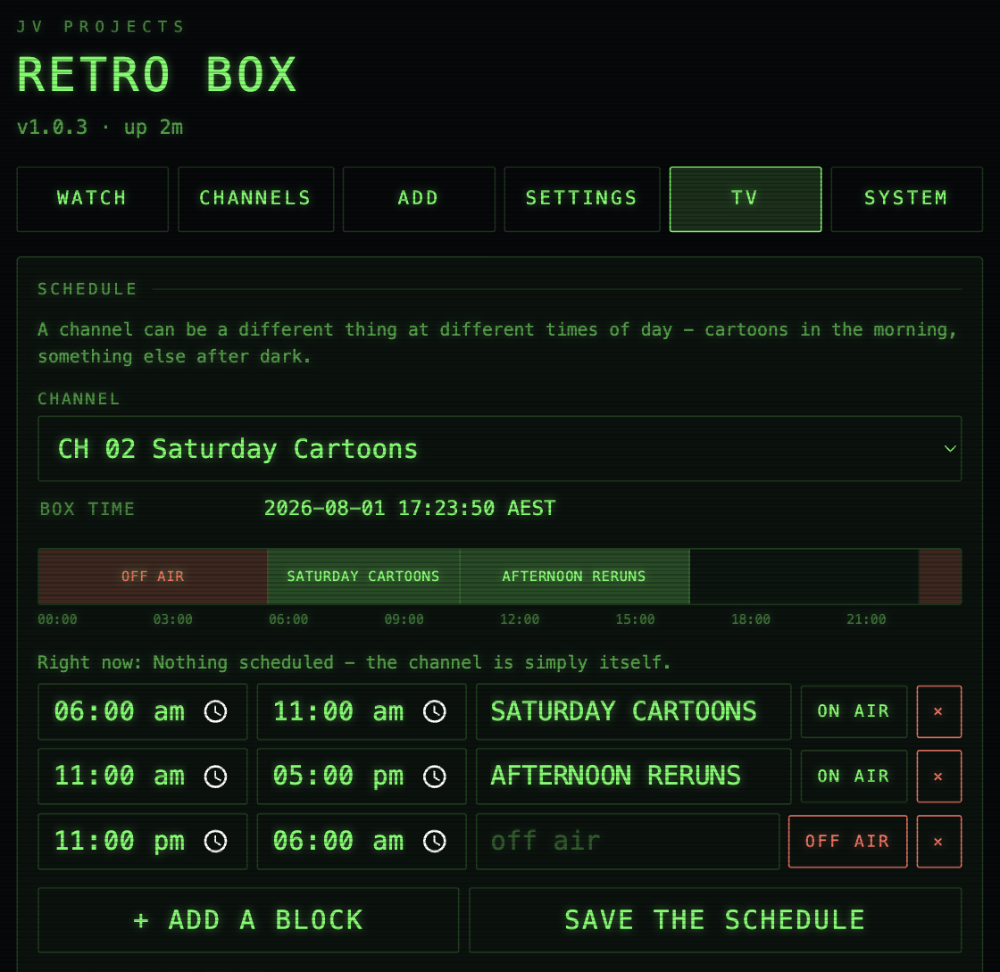
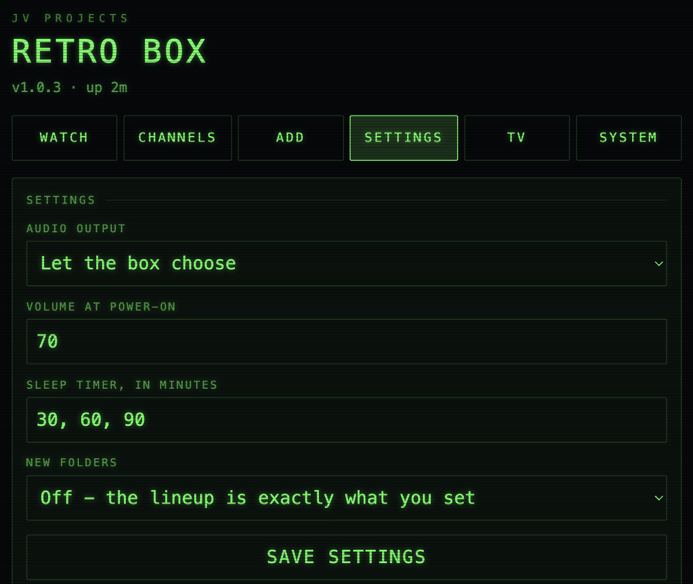
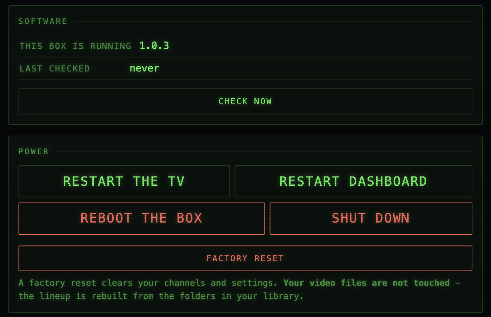

# Retro Box

**Turn a spare Linux box into the cable box you fell asleep in front of.**

**[The project site →](https://vanticstudio.github.io/RetroBoxJVProjects/)** —
what it is and what it feels like, in one page. MIT licensed. It ships empty;
you supply your own files.

Retro Box plays folders of video off a drive as if they were real TV
**channels**. Flip to a channel and something is already playing (starting a few
seconds in, like you just tuned in); when an episode ends, the next one rolls
automatically on an endless shuffle. Channels change with the clock, station
bumpers stitch the night together, a proper channel guide tells you what's on,
and a sleep timer turns the whole thing off when you don't. It boots straight to
the TV on power-up, is driven by a plain remote, sends audio over HDMI, and has
an authentic late-90s vibe — a green on-screen display and a curved "CRT"
picture. No menus, no apps, no accounts, no recommendations. Just a remote and
channels.

The setup guide has two parts:

1. [**What you need**](#1-what-you-need)
2. [**Step-by-step setup**](#2-step-by-step-setup) — flash it, install it, fill it with shows

After that: [what the browser console does](#the-box-in-a-browser), the
[configuration reference](#configuration-reference-highlights), and
[troubleshooting](#troubleshooting).

---

<a id="run-the-installer-once"></a>

> ## ⚠ Already have a Retro Box? Run the installer once, by hand.
>
> **If your box was set up before this version, five things on the dashboard
> are broken right now and pressing them again will never fix them:**
> **Restart**, **Reboot**, **Shut down**, the **clock**, and everything on the
> **Network** page.
>
> Two files live *outside* your copy of the project — the box's systemd service
> file and its `sudo` rules — and **an update installed from the dashboard
> cannot replace either of them.** It only updates the code in the project
> folder. So this one step has to be done over SSH:
>
> ```bash
> cd ~/RetroBox && ./scripts/install-service.sh
> ```
>
> (`./scripts/install.sh --service` does the same thing plus a full package
> re-check; either is fine, the shorter one is quicker and needs no internet.)
>
> It leaves your `config.yaml`, your channels and your videos completely alone.
> It takes a few seconds. Once it's done, it's done — see
> [Updating later](#updating-later) for what each file changed and why.
>
> **You'll know you need it if:** the **Network** page shows everything
> correctly but saving comes back with an error ending in *"this box may need
> scripts/install-service.sh run again"* — or, on a slightly older version, just
> `sudo: a password is required` on a box you never gave a password to.

---
## What it looks like

The television itself is on the television. Everything else happens in a browser
on your phone or laptop, at `http://retrobox.local` — no app, no account, no
password.

| | |
|---|---|
| **What's on now** — leave it open on a phone. The channel, the episode, how far through it is, and what's playing on every other channel.<br><br> | **The remote** — change channel, volume, standby and shut down from the sofa, without hunting for the actual remote.<br><br> |
| **Channels** — rename, renumber, reorder the dial, point a channel at a different folder, or delete an episode you're done with. Removing a channel never deletes your videos.<br><br> | **Adding shows** — drag a folder of episodes onto the page and it becomes a channel. Big uploads survive a dropped wifi connection or a laptop going to sleep.<br><br> |
| **Dayparting** — a channel can be a different thing at different times of day. Cartoons in the morning, reruns in the afternoon, a hard sign-off overnight.<br><br> | **Settings** — audio output, the volume it powers on at, and the sleep-timer ladder.<br><br> |

Plus updates over the air — never applied on their own, and put back
automatically if the television doesn't come back — and the buttons you hope
never to need:



---
## 1. What you need

Nothing exotic. This is meant to run on whatever old box you already have.

| | |
|---|---|
| **A machine** | Any x86 mini PC that will boot Linux — an ex-office desktop, a NUC, a Tiny/SFF thing off eBay — or a Raspberry Pi 4. 4 GB RAM is plenty, and a decade-old CPU is fine once hardware decode is on. |
| **An HDMI display** | A TV, ideally. Any monitor works. |
| **A [Flirc USB adapter](https://flirc.tv/products/flirc-usb-receiver) and a remote** | The Flirc teaches itself any IR remote and presents it to Linux as a plain keyboard. The remote can be anything — an old cable box remote, a cheap universal. |
| **Another computer** | Windows, Mac or Linux, to write the USB stick and SSH in. You won't need a keyboard on the box itself after first boot. |
| **A USB stick or SD card** | 8 GB+, to install from. |

For the remote, six buttons cover the basics (channel ±, volume ±, mute, power).
Four more unlock the rest — **guide**, **sleep**, **info** and **last channel** —
plus a number pad if you want to punch in channel numbers. Any junk-drawer TV
remote has all of them, which is rather the point.

---

## 2. Step-by-step setup

### Step 1 — Flash the OS

Install **Ubuntu Server** ([ubuntu.com/download/server](https://ubuntu.com/download/server))
on a PC, or **Raspberry Pi OS Lite** on a Pi. Debian works too. Write it with
[balenaEtcher](https://etcher.balena.io/) or Raspberry Pi Imager.

Whichever installer you use, do these three things during it:

- **Don't install a desktop.** Retro Box draws straight to the console via
  KMS/DRM, and a desktop environment will fight it for the screen.
- **Enable SSH**, so you can drive the rest from your own computer.
- **Set the hostname to `retrobox`** and pick a username and password.

> Raspberry Pi Imager hides hostname/SSH/user behind the gear icon before you
> write. Ubuntu Server's installer asks during setup.

### Step 2 — First boot and SSH in

Plug in HDMI, network and power, and let it boot to a text login prompt. The
box prints its IP address above that prompt — something like
`192.168.1.42`. Note it down, then, from your own computer:

```bash
ssh youruser@retrobox.local
# or, if .local doesn't resolve on your network:
ssh youruser@192.168.1.42
```

Accept the fingerprint the first time. The password prompt stays blank as you
type — that's normal, not a frozen terminal.

> `.local` needs mDNS. If it doesn't resolve, the IP always works, and
> `sudo apt install -y avahi-daemon` on the box fixes it for next time.

### Step 3 — Install

```bash
git clone https://github.com/vanticstudio/RetroBoxJVProjects.git ~/RetroBox
cd ~/RetroBox
./scripts/install.sh --service
```

That's the whole install. One script, no separate hardware step, no driver
hunting. It works out what it's running on and does the right thing:

- **Detects the platform** — Pi or PC — and installs the right `libmpv` for
  your distro, whose package name has changed across releases.
- **Detects the GPU on a PC** and installs the matching VA-API decode driver
  (Intel, AMD, or software decode on NVIDIA, which is the safe default).
  On a Pi it skips this entirely, since the Pi decodes through V4L2.
- **Sets up the LAN file share** so you can drag shows on from any PC
  ([step 5](#step-5--get-shows-onto-it)). Pass `--no-share` if you'd rather it
  didn't.
- **Makes the box answer to `retrobox.local`** — it installs Avahi, and renames
  the machine to `retrobox` if it isn't called that already (mDNS follows the
  system hostname, so the documented address only works if the two agree).
- **Installs the on-screen font** and generates the static/glitch/colour-bar
  filler clips.
- **Creates the library folder** at `/media/retrobox`, with the Retro Box splash
  in it so a box with nothing on it yet has something to play.
- **Creates a starter `config.yaml`** if there isn't one — pointed at that
  library, with `auto_channels` on, so a folder dropped in becomes a channel —
  then runs `retrobox --check` over it. A config the television would refuse to
  start with **stops the install** rather than being noted and installed anyway.
- **Stops anything waiting for a network at boot**, so a box switched on with
  no cable in it shows a picture instead of counting a red *"Wait for Network to
  be Configured"* job to two minutes on the television.
- **With `--service`, proves the box works before it says so** — that both
  services are up, and that the dashboard can actually reach the television.
  See [that check](#the-check-that-the-dashboard-can-reach-the-tv) for what it
  looks for and why.

`--service` is optional but worth adding now: it installs the systemd unit so
the box boots straight to TV with no login. You can add it later with
`./scripts/install.sh --service`.

> **If `retrobox: command not found` in a later SSH session** — the command
> lives in the project's virtual environment, which a fresh shell doesn't know
> about. Either run `source ~/RetroBox/.venv/bin/activate` first, or call it by
> full path: `~/RetroBox/.venv/bin/retrobox`. The systemd service always uses
> the full path, so autostart is unaffected either way.

> **Building boxes rather than one box?** There's an unattended installer that
> takes a bare mini PC to a finished Retro Box with no keyboard and no typing —
> two USB sticks, power on, walk away. It is a separate manual:
> [`installer/README.md`](installer/README.md).

### Step 4 — Build the channel lineup

```bash
retrobox --setup
```

The wizard asks for each channel's name and folder, counts the video files it
finds so you can catch a typo'd path immediately, and picks your HDMI audio
output on its own. It writes `config.yaml` for you.

Confirm it:

```bash
retrobox --check
```

That lists every channel with its episode count, any dayparts, your bumper
count and the sleep-timer ladder. A channel showing `NO EPISODES FOUND` has a
wrong path or an unrecognised file extension.

> Audio landed on the wrong output? `retrobox --list-audio` prints every device
> and you can paste the HDMI one into `audio_device` in `config.yaml`. You can
> also change it live from the on-screen menu.

### Step 5 — Get shows onto it

The installer already shared the library on your network, so this is drag and
drop.

**From Windows:** open File Explorer, click **Network** in the sidebar, and wait
up to a minute or two for **RETROBOX** to appear. Open it, open **Library**, and
drag your show folders straight in. No drive mapping, no path typing, no login
prompt.

**From Mac:** Finder → Go → Connect to Server → `smb://retrobox/Library`.

**From Linux:** `smb://retrobox/Library` in any file manager, or mount it with
`gio mount`.

One folder per channel is the whole convention:

```
/media/retrobox/
├── sitcoms/
│   ├── S01E01.mp4
│   └── S01E02.mp4
├── music-videos/
├── talk-shows/
└── movies/
```

Anything you drop lands in `/media/retrobox`, which is exactly where channels
are scanned from, so `retrobox --check` sees it straight away. See
[Dropping files on from another PC](#dropping-files-on-from-another-pc) if the
box doesn't show up under Network.

### Step 6 — Program the remote

This happens on **your computer**, not the box — the Flirc is programmed once
and remembers its mapping in firmware.

1. Unplug the Flirc from the box and plug it into your computer.
2. Install the Flirc app from [flirc.tv/downloads](https://flirc.tv/pages/downloads).
3. Choose the **Full Keyboard** controller.
4. Click a key on the on-screen keyboard, then press the remote button you want
   to use for it:

   | Click this key | Press this remote button | Does |
   |----------------|--------------------------|------|
   | **Up arrow (↑)**   | Channel-Up   | Channel up *(moves the highlight in the guide/menu)* |
   | **Down arrow (↓)** | Channel-Down | Channel down *(likewise)* |
   | **Right arrow (→)**| Volume-Up    | Volume up |
   | **Left arrow (←)** | Volume-Down  | Volume down |
   | **m**              | Mute         | Mute |
   | **p**              | Power        | Standby (blank the screen) |
   | **g**              | Guide        | On-screen channel guide |
   | **s**              | Sleep        | Cycle the sleep timer |
   | **i**              | Info         | Re-show the channel banner |
   | **l**              | Last / Back  | Jump to the previous channel |
   | **Enter**          | OK / Select  | Confirm |
   | **0**–**9**        | Number pad   | Type a channel number |

5. Plug the Flirc back into the box.

No config changes needed — those keys work as shipped. Any button can be
remapped later via `key_overrides` in `config.yaml`.

### Step 7 — Test it, and confirm autostart

```bash
retrobox
```

Channels should appear and respond to the remote. Press `q` on a keyboard, or
Ctrl+C over SSH, to stop.

If you passed `--service` back in step 3, autostart is already live — check it:

```bash
systemctl status retrobox
sudo reboot          # the real test: it should come up straight into TV mode
```

If you didn't, add it now:

```bash
cd ~/RetroBox && ./scripts/install.sh --service
```

Logs live in `journalctl -u retrobox -f` when something looks wrong.

### The check that the dashboard can reach the TV

The television and the dashboard are two separate programs. Everything they say
to each other goes through two files in one folder: a status snapshot the TV
writes and the dashboard reads, and a small socket the TV listens on so the
dashboard's buttons have somewhere to go. Both services look for that folder in
`/run/user/<uid>` — which Linux creates **for a login session**, and this box
doesn't have one. It's switched on at the wall, has no keyboard, and nobody ever
logs into it.

So `./scripts/install-service.sh` marks the box's account as *lingering*, which
is what makes that folder exist with nobody logged in, and then checks it really
did appear. It didn't used to, and the result was a box that looked perfect
from the outside: picture on the TV, dashboard rendering in the browser, its
status panel insisting the TV isn't running, and every button coming back with
an error. It was invisible while installing precisely because whoever installs
it is *logged in over SSH* — so the folder exists for their session, everything
works while they watch, and it disappears the moment they log out.

Once the services are up, the installer waits — up to about a minute, since a
box with a big library takes a while to scan it — and confirms the TV has
actually written its status file and is listening on its socket. If either
never appears, the install **fails and names the missing one** rather than
printing "Done!" over a half-dead box. Two honest caveats:

- The check needs a running system, so during an unattended image build (where
  nothing has been started yet) it says out loud that it was skipped and why,
  instead of quietly passing.
- If you've set `input.web: false` in `config.yaml`, that box has no control
  socket by design — the installer says so and doesn't count it as a fault.

Re-running `./scripts/install-service.sh` is the fix for a box already in the
field, and it's safe to run on one that's already right.

### Step 8 — Things that work with no setup at all

Worth knowing about so you don't trip over them and assume something's broken:

- **The box in a browser.** `http://retrobox.local` shows what's on;
  `http://retrobox.local/dash` manages it. No port number, no app, nothing to
  set up — the installer handles the name and the port. See
  [The box in a browser](#the-box-in-a-browser).
- **The on-screen menu.** Press **Escape** on an attached keyboard for channels,
  volume, audio output, shutdown and an About screen. It pauses playback and
  resumes exactly where it left off. A mouse works while it's open — hover to
  highlight, click to pick — and the pointer is completely invisible and inert
  the rest of the time, whether or not a mouse is even plugged in. Escape used
  to quit the app; **`q` does that now.**
- **The boot splash.** A JV Projects clip ships in `retrobox/assets/` and plays
  once at power-on, before the first channel — **on by default**, so a box shows
  its own branding without being asked. Any button skips it, and a hard
  30-second timeout means a clip that never finishes still hands over to channel
  one. Set `boot_splash: false` (or **TV → Start-up clip → TURN IT OFF** in the
  console) to go straight to a channel; see
  [`retrobox/assets/README.md`](retrobox/assets/README.md) to swap in your own.
  A clip you upload has to be a video, under 15 seconds and under 128 MB.

### Step 9 — Optional: read-only protection

Pulling the plug mid-write can corrupt the filesystem. Far less likely on an
SSD than a Pi's SD card, but if you want it to be impossible, make the root
read-only. The two platforms genuinely differ here, and `install.sh` prints
whichever one applies to the machine it ran on:

**On a PC (Debian/Ubuntu):**

```bash
sudo apt install overlayroot
# then set this line in /etc/overlayroot.conf and reboot:
#   overlayroot=tmpfs
```

Writes go to RAM and vanish on reboot. To make a real change later, run
`sudo overlayroot-chroot`, edit, and reboot.

**On a Raspberry Pi:**

```bash
sudo raspi-config     # Performance Options -> Overlay File System -> Enable
```

`raspi-config` doesn't exist on x86, and `overlayroot` isn't in Raspberry Pi OS
— use whichever matches your box.

> **One consequence, and it's the right one.** Nothing written to the root
> filesystem survives a reboot while this is on, so **software updates are
> refused before they change anything** and say why, rather than appearing to
> work and quietly vanishing overnight. Turn it off, update, turn it back on.

**Done.** Power it on and it comes up as a television.

## Using it day to day

| Do this | On the remote |
|---------|---------------|
| Change channels | Channel up / down |
| Jump to a channel | Type its number |
| Adjust volume | Volume up / down |
| Mute | Mute |
| See what's on everywhere | **Guide** |
| Open the settings menu | **Escape** (keyboard) |
| Browse the guide | Channel up / down while it's open |
| Tune to a highlighted row | **OK** |
| Set a sleep timer | **Sleep** (cycles 30 → 60 → 90 → off) |
| Re-show the channel banner | Info |
| Bounce to the last channel | Last / Back |
| Standby (blank screen) | Power |
| **Turn off** (clean shutdown) | Volume-down again when already at 0 |

---

## The six things that make it feel like cable

### Dayparting — channels that change with the clock

Real cable never showed the same thing at 3pm and 3am. Give any channel a list
of wall-clock windows and it can rename itself, swap in a different folder, or
sign off entirely:

```yaml
  - number: 3
    name: "Music Videos"
    path: /media/retrobox/music-videos
    dayparts:
      - from: "22:00"
        to: "02:00"
        name: "120 MINUTES"                        # renames the channel...
        path: /media/retrobox/alt-rock-block   # ...and swaps the programming
      - from: "02:00"
        to: "06:00"
        off_air: true                              # colour bars, no programme
```

Windows use 24-hour local time and may wrap past midnight. They're tested in the
order you write them, so the first match wins; outside every window the channel
falls back to its own name and folder.

Boundaries take effect **immediately**, mid-episode — 22:00 arrives and the
channel changes under you, exactly like the real thing. A window that only
renames the channel (a `name` with no `path`) doesn't interrupt playback: the
episode keeps running and just the on-screen ident changes.

> Times are local to the box. Check it with `timedatectl`, and set it with
> `sudo timedatectl set-timezone Australia/Brisbane` (or wherever you are).

#### When the box doesn't know what time it is

Dayparting is the one feature that goes wrong *quietly* when the clock is wrong.
Nothing errors. The box just plays the late-night block at teatime, and it looks
like the schedule is broken rather than the clock.

So it doesn't guess. When the clock can't be vouched for, **dayparting pauses**:
no window is applied and every channel plays as itself — its own name, its own
folder, which is what it is outside every window anyway. Nothing crashes and
nothing goes off air. A box in this state still plays television; it just plays
the same television all day.

Two things can pause it:

- **An impossible date.** A clock reading before 2020 (or after 2100) was never
  set, so the box spots this entirely on its own — no network, nothing to
  configure.
- **A clock that has never been checked against a time server.** A box that's
  never been on a network has no way to know the time.

The box says which, and the System page carries the sentence that matters:

> The clock is wrong: this box thinks it is 2010-07-01 00:00, which cannot be
> right, so channels that change through the day are running as themselves
> instead. A box whose clock resets like this every time it is switched off
> almost always has a flat CMOS battery on the motherboard — a two-dollar coin
> cell. Replacing it, or leaving the box on a network so it can fetch the time,
> fixes this.

That's the whole point of saying it out loud. A dead CMOS battery is one of the
commonest faults on a decade-old office mini PC, it comes back every single time
the box is switched off at the wall, and nobody could reasonably guess it.

The schedule editor keeps working either way — it's answering "what *would* be
on at 3am", which is a question a box with a broken clock can still answer — and
it shows a note at the top when the schedule isn't currently being applied.

### Broadcast mode — channels that run whether you're watching or not

`tune_in` decides what happens the instant you land on a channel. The default,
`random`, starts a fresh episode a few seconds in. `resume` picks up where you
left that channel. `broadcast` is the one that feels like television:

```yaml
tune_in: broadcast
```

Each channel gets a fixed shuffled running order and a start time, and from then
on it advances against the wall clock — so a channel you haven't watched all
evening has still been "airing" the whole time, and tuning in drops you partway
through whatever would be on. Flip away and back ten minutes later and you've
missed ten minutes.

It needs `ffprobe` (the installer brings it in with ffmpeg) to measure how long
each episode runs. That measuring happens the first time you tune to a channel,
so a large channel takes a moment on its first visit; results are cached in
`~/.cache/retrobox/durations.json`, keyed on each file's size and modification
time, so it only ever happens once per file. Anything that can't be probed is
assumed to be a 22-minute slot and the schedule carries on regardless.

The same measurement is what tells the box whether a file has a picture in it,
so that cache stores three answers and not two: yes, no, and *couldn't tell*.
That last one matters — it's the difference between "this would play as a black
screen" and "we don't know", and only the first is ever held against a file.
The cache is only ever a shortcut: delete the file and the box simply measures
everything again, and if it can't make sense of an entry — after an update, or
because the power went out mid-write — it re-measures that file rather than
believing it.

### Station bumpers — the glue between shows

Drop a folder of short clips (idents, "we'll be right back", station promos) and
one plays between episodes:

```yaml
bumpers: /media/retrobox/bumpers
bumper_chance: 1.0        # 0-1: how often one airs between episodes
bumper_max_seconds: 30    # hard cap so one long file can't stall the box
```

Bumpers are shuffled the same way episodes are — a shuffle bag, so every clip
plays once before any of them repeats and you never get the same one twice in a
row, even across the join where the bag refills — and they roll straight into
the next show with no gap. A channel can opt out with `bumpers: false`; a news
channel with idents between items is wrong rather than nostalgic.

### The channel guide

Press **guide** for a green cable-box grid: every channel, its current name, and
what's on. Arrow up and down to browse it — the highlighted row is marked `>`,
and the channel still playing behind it is marked `*`. Press **OK** to tune to
the highlighted row. Off-air channels say so. The header carries the time and,
if one is running, the sleep timer. It clears itself after `guide_seconds`
(default 8), or when you press guide again.

### The on-screen menu

Press **Escape** on an attached keyboard for a settings overlay. (A remote's
`Menu` button works too if it has one, and `o` is a stdin-friendly alias for
when you're driving it over SSH.) It **pauses playback** and resumes exactly where it left off
when you close it.

| Row | Does |
|-----|------|
| **Channels** | The full lineup — jump straight to any channel, no stepping |
| **Volume** | Left/right adjusts; works from any row |
| **Audio output** | The HDMI outputs `hwdetect` finds. Applies **immediately, for this session** — it does not rewrite `config.yaml`, so a reboot returns to the configured device |
| **Shut down** | Confirms first, then shuts the machine down cleanly |
| **About** | JV Projects, and the installed version |

Drive it with the arrow keys and **OK**, or with a mouse — hover highlights a
row, click activates it. Back/Last steps out of a sub-screen; **Escape** closes
the menu from anywhere.

> **The box boots straight into channel mode with nothing on screen**, driven by
> the remote as always. The pointer is switched off and hidden from boot —
> whether or not a mouse is plugged in — and only becomes visible and clickable
> while the menu is open. Close the menu and it disappears completely.
>
> Escape used to quit the application. It now opens the menu; **`q` still
> quits.**

### The sleep timer

Press **sleep** to cycle 30 → 60 → 90 minutes → off. While it runs, a small
`SLEEP 29m` readout sits in the corner and counts down. When it runs out:

```yaml
sleep_timer: [30, 60, 90]   # your own ladder; `false` disables the button
sleep_action: standby       # standby (blank screen) | off (clean shutdown)
```

`sleep_action: off` is the good one for a box that lives next to a bed — it
shuts the machine down properly rather than leaving it idling all night.

---

## Dropping files on from another PC

The installer sets up an SMB share so the library is reachable from any machine
on the network, with no drive mapping and no login prompt.

**From Windows:** open File Explorer → **Network** → the box appears by hostname
→ open **Library** → drag folders in. That's it.

**From macOS:** Finder → Go → Connect to Server → `smb://retrobox/Library`.

Anything dropped in lands in `/media/retrobox`, which is where channels are
scanned from, so `retrobox --check` picks it up immediately.

```bash
./scripts/setup_lan_share.sh              # re-run any time
./scripts/setup_lan_share.sh --path /srv/media   # share somewhere else
./scripts/install.sh --no-share           # skip it at install time
```

> **The share is guest-writable** — that is what removes the login prompt.
> Anyone who can reach the box on the network can add and delete files in the
> library. That's the right trade on a home LAN; don't do it on a network you
> don't control.

---

## The box in a browser

Point any browser on the network at the box. No port number, no app to install:

```
http://retrobox.local          what's on right now
http://retrobox.local/dash     the management console
```

**`http://retrobox.local` is what's on TV.** Channel and programme, how far
through it is, and what's on the other channels — the page to leave open on a
phone on the arm of the sofa. It only reads; nothing on it can change the
channel by accident.

**`http://retrobox.local/dash` is the console.** Seven tabs — **Watch**,
**Channels**, **Add**, **Files**, **TV**, **Settings** and **System** — and
between them they cover everything you would otherwise have to SSH in for.

> **If `retrobox.local` doesn't resolve**, use the box's IP address instead —
> `http://192.168.1.42/` and `http://192.168.1.42/dash`. The box prints its IP
> above the login prompt, and `hostname -I` on the box shows it too.
>
> `.local` works over mDNS, which macOS, iOS, Android and Windows 10+ all speak
> without any setup — the installer puts Avahi on the box to answer it. Some
> corporate and guest networks block multicast, which is when you need the IP.
> Bare `http://retrobox` with no `.local` works only if your router registers
> DHCP hostnames into its own DNS; plenty do, plenty don't, so it's a bonus
> rather than the address to write down.

**Watch** — what's on now, the channel list with jump-to-channel, volume and
mute, standby, and a shutdown button. The same things the on-screen menu does,
in the same phosphor green, for when the remote is under a cushion.

**Channels** — the lineup, editable. Tap a channel to rename it, give it a
different number, point it at another folder, move it up or down the dial, or
remove it. Removing a channel only takes it off the dial; **your video files are
never deleted by it** — deleting files is the **Files** tab's job, and it asks
first. There's an "add channel" button for a folder you've
already dropped on over the share. Folders picked here have to be real folders
inside your media library (that's what `media_root` is for), so a typo is
refused on the spot rather than becoming a channel that plays nothing.

Expanding a channel also lists **the episodes on it, with their sizes** — you
can upload a video straight from your phone, with a progress bar, and delete one
you don't want. (That list lives inside Channels; it isn't a tab of its own.)

**Add** — the bulk one. Drag a folder of episodes onto the page and it becomes a
channel named after the folder, filled with what was in it. Drag files onto an
existing channel and they get added to it. Before anything moves it shows you
what it found, what it will skip and why, and lets you set the channel's name and
number.

Uploads are sent in pieces, so they survive real life: if your wifi drops, your
laptop sleeps, you close the tab or the box loses power, the parts already
transferred stay on the box. Come back, pick the same files again, and it carries
on from where it stopped instead of starting over. Unfinished uploads are listed
under **Add**, and anything left untouched for a day is cleared off the disk on
its own so it can't quietly eat your space.

Anything half-arrived — including a single video or a boot splash sent while the
power went off — waits in that same temporary space rather than in the channel
folder. That's what makes it visible: **Settings** counts it in the space
unfinished uploads are holding, and the same one-day clean-up takes it away. The
television never sees it, so a part-file can't turn up on the dial.

Finishing an upload is all or nothing. If any file is still short a piece,
nothing at all is moved into the channel and the box names the file that's
short — you never end up with half a series on the dial underneath a message
saying the upload failed. Send the rest and finish it again. And if a commit is
interrupted part way through, the box knows which episodes it had already
written: the second attempt finishes the job and reports them as uploaded,
rather than as duplicates of somebody else's files.

Channels don't have to live in your media library — one can point at a
plugged-in drive. That's a `config.yaml` edit rather than something the browser
will set for you, but once it's there everything works exactly the same way:
uploading to a channel like that lands on *that* drive, and the box checks
*that* drive has room before it accepts the upload rather than only looking at
the card it boots from.

**Files** — the whole library, as a file manager, from a phone. Browse the
folders, tick what you want, and delete it — one episode, a whole show, or a
mixed handful — and rename a folder without breaking the channel that plays
from it. This is the tab that replaces plugging a keyboard in.

- **Nothing is destroyed by deleting.** Everything you delete moves to a trash
  folder on the same disk. That means **deleting frees no space at all**, which
  is the single most surprising thing about it, so every screen that mentions
  deleting says so out loud and offers **Empty the trash** — the one action on
  this box that really does destroy a video — right beside it. The trash keeps
  things for a fortnight and then clears them itself, and because this box gets
  switched off at the wall rather than left running, it does that tidying at
  start-up as well as on a timer.
- **The confirmation tells you what it will actually cost**, before anything
  moves: how many files, how much space, and **which channels are affected**.
  Delete a folder a channel plays from and it says so by name — that channel
  will have nothing left, and the television will show colour bars and
  `CH 04  Cartoons  -  NO SIGNAL` until you point it somewhere else or restore
  the folder. A scheduled block that plays from the folder is named the same
  way. "Are you sure?" is not a question anybody can answer; this is.
- **Restore puts it back where it came from**, rebuilding the folder if the
  whole thing went. If something has since taken the name, the box refuses and
  asks — and if you say replace, the file that was there goes to the trash
  rather than away, so changing your mind never costs anybody a file either way.
- **Renaming a folder repoints everything that plays from it** in the same
  step: the channel, and any scheduled block that had its own folder. Both, or
  neither — if the config can't be written the folder goes back to the name it
  had and nothing changes.
- **Deleting or renaming a folder an upload is still landing in is refused**
  rather than leaving gigabytes writing into a folder that has moved. The page
  offers to cancel those uploads and carry on.
- The box's own folders — the trash, the upload spool, the start-up clip — are
  **listed but cannot be selected**. Somebody hunting for forty missing
  gigabytes has to be able to see where they went; nobody should be able to
  delete the machinery by accident.

The trash and the space it is holding also appear in the storage block on
**System**, so it can never become usage nothing on the box can account for.

**TV** — the things that make it a television rather than a video player:

- **Schedule.** A channel can be a different thing at different times of day —
  cartoons in the morning, something else after dark, colour bars overnight.
  You get the day laid out as a bar you can read at a glance, including blocks
  that run past midnight, and a "what would be on at 3am" box so you don't have
  to wait until 3am to find out. Overlapping blocks are refused rather than
  guessed at. A block that swaps in a different folder has that folder checked
  the moment you save it — it has to be a real folder inside your library — so a
  typed-wrong name is refused there and then, instead of turning into a channel
  that goes quiet at six o'clock this evening for no visible reason. Editing a
  block's times keeps its folder, which it didn't always: nudging a time used to
  quietly drop a folder swap you'd written into `config.yaml` by hand. If such a
  block points somewhere outside your library — a plugged-in drive, say — the
  editor now says so and refuses to save rather than throwing it away; move the
  folder into the library or remove the block. The box's clock is shown right
  there, because a schedule is only as right as the clock underneath it.
- **Filler and bumpers.** Generate the colour bars, static and glitch clips,
  play them back, set how often station idents air between episodes and how long
  one may run, choose the channel-change effect (none, glitch or static), and
  turn idents off per channel — a news channel with idents between items is
  wrong.
- **Start-up clip.** Preview the JV Projects clip, replace it with your own, or
  turn it off. An uploaded clip has to be a video, under 15 seconds and under
  128 MB, with a picture actually in it. Whatever you put there, **the
  television gives up on it after 30 seconds and starts anyway** if it hasn't
  finished — it can never leave you looking at a black screen.
- **Picture.** The CRT effect and how long the channel banner stays up. **The
  sliders change the television as you move them** — there is no correct amount
  of curvature, so the only way to set it is to watch the television while you
  drag, and the picture follows your finger rather than waiting for a save.
  Nothing that is playing is disturbed: the programme carries on and simply
  looks different. Turning the effect off removes it outright rather than
  leaving a do-nothing pass running, so it also gives the box's little
  processor its work back.

  What you are watching while you drag is a **preview**, and a preview is never
  written to the box. Only SAVE PICTURE SETTINGS keeps it. PUT THE SAVED
  PICTURE BACK undoes the whole experiment in one press, and so does closing
  the browser, so does the wifi dropping mid-drag, and so does switching the
  box off at the wall — a preview only ever exists on the screen, and only for
  as long as something is asking for it. If the dashboard goes quiet for twenty
  seconds the television puts your saved picture back on its own, so nobody can
  leave a half-finished experiment on somebody else's television by wandering
  off.

  The one setting here no slider can show you is how long the channel banner
  stays up, so SHOW THE CHANNEL BANNER puts it on the television exactly as a
  viewer sees it.

**Settings** — audio output, the volume the box powers on at, the sleep-timer
ladder, and whether new folders automatically become channels (that last one is
the one that only takes effect at the next start-up, and the page says so when
you save it). It also shows how much space unfinished uploads are holding.
Everything else in `config.yaml` is edited on the box; the page refuses a
setting it doesn't own rather than guessing.

**System** — the answer to "is my box alright", and the last of the reasons
anyone had to open a terminal on it:

- **Whether the box can still look after itself**, above everything else on the
  page. Restarting, rebooting, shutting down, setting the clock and every
  button on the **Network** panel need permission that is granted once, when
  the box is set up — see
  ["How the box gets root"](#the-box-in-a-browser) — and a box set up by an
  earlier version was granted a shorter list than the current one needs.
  Nothing used to notice. One box reached its owner playing video perfectly,
  with **Shut down** working and **Restart**, **Reboot** and the whole
  **Network** page failing weeks later. So the box asks — at every start-up,
  and again each time you open this page — and if the answer is no, a message
  sits at the top of it: what has stopped working, named button by button
  rather than "some features are unavailable"; that nothing has happened to
  your videos, your channels or your settings, and the television is still
  playing; and the one command to run on the box, with your own folder and your
  own account already filled in, ready to be copied. **This is the only place
  in the whole product that asks you to type a command**, and the reason it has
  to is the same reason there is no login: a page anyone on your wifi can reach
  that could grant itself root would be a box anyone on your wifi could take
  over. There is a **TRY THE REPAIR FROM HERE** button and it is honest about
  that — pressed on a normal box it changes nothing and says so, in a sentence
  rather than a shrug. The check knows the difference between *never granted*,
  *granted an older, smaller list* and *granted but something is stopping the
  box using it* — the third one is the service unit rather than the permission,
  so it is explained and the repair is not offered, because re-running the
  installer would not fix it. Nothing the machine said about any of this is
  ever put on the screen: it goes to the log, where **Copy for support** picks
  it up. Asking costs a few dozen very short-lived checks, so it happens when
  the page opens or when you press the button — never on a timer.
- **Health.** It opens with one sentence answering the only question anyone
  came here to ask — "This box is coping fine", "This box is working hard but
  keeping up", "This box is struggling to keep up with what it is playing" —
  and then the reasons behind it. Underneath: how much of the processor is
  actually in use as a **measured percentage** and each core separately (on two
  cores, one pinned and one idle is not the same thing as both at half); memory
  and how much is left, with swap shown only if any is in use; the load average
  kept but explained in words; dropped frames from the player where it reports
  them; and temperature, judged against the limit the part's own manufacturer
  publishes rather than a number we picked. Alongside the processor, memory and
  temperature numbers, the highest reading and whether it's climbing, steady or
  falling **while this page has been open** — not since the box was switched on,
  because nothing is measured while nobody is looking. It costs the box next to nothing and says what it
  cost, measured. Plus the standing facts: version, uptime, the addresses it
  answers on, free space on the system disk and the library disk *separately*
  (they're often different disks, and it's the system one that stops the box
  booting), **how much of the library disk the trash is holding** — it counts
  as used space and nothing else on the box would explain it — whether hardware
  video decode is actually working, which remotes are live, and whether the file
  share is up. Written as plain answers — "Hardware
  decode: working, Intel UHD 630" — with the raw detail behind a toggle for when
  you actually want it.
- **Remote test.** Press a button on your remote and watch it appear, with
  which receiver saw it and what it did. Programming the Flirc is the one step
  that can't be automated away, and this turns checking it from pointing at the
  telly and guessing into something with feedback. It watches; it doesn't take
  the remote over.
- **Log.** The last few hundred lines from the TV and the dashboard, filtered by
  service and level, with a plain-text search. **Copy for support** puts the log
  and the system information on your clipboard as one block of text — so nobody
  has to be talked through `journalctl` over the phone.

  Both the panel and the support bundle take out anything `sudo` wrote about
  itself. "sudo: interactive authentication is required" means nothing to
  somebody standing in front of a television and sends them looking for a
  password they were never given; the permission banner on this same tab says
  what actually fixes it. What the box itself wrote around those words stays,
  and so do the file names — `/etc/sudoers.d/retrobox-system` is what tells a
  support conversation which grant is missing. The unedited line is still in
  `journalctl -u retrobox-web`, where somebody who can act on it is looking.
- **Clock.** Timezone, the time, and whether anything is actually keeping it
  correct. It warns when nothing is: channels that change with the time of day
  drift silently on a box with no internet, and that's miserable to diagnose.
- **Config file.** Download a copy before you change much, or restore one — an
  uploaded config is loaded and checked before it's allowed to replace the live
  one, so a bad file is refused rather than leaving you with a box that won't
  start. That check covers every folder it names, including the ones inside a
  schedule, and every setting that names a command to run or a folder to write
  into — a config that points your library at the system's own directories, or
  makes `.py` a kind of video, or asks for a power-off command that isn't a
  plain shutdown, is refused outright, because this page has no login and
  anyone on your wifi can upload to it. (The full list is under
  ["The settings the box checks instead of obeying"](#the-settings-the-box-checks-instead-of-obeying).)
  **RESTORE FROM A FILE** opens a file picker and takes the file as soon as you
  choose one — choosing it *is* the confirmation, so pick carefully. The
  once-only `config.yaml.bak` is offered here too, and *that* one asks twice.
  Either way the restore takes the same lock every other edit takes, so it can't
  land in the middle of somebody renaming a channel on their phone and quietly
  lose one of the two.
- **Power.** Restart the TV, restart the dashboard, reboot, shut down. Every one
  asks twice. Restarting the dashboard tells you it's going and reconnects on
  its own.
- **Factory reset.** Clears channels and settings back to defaults. **It does
  not touch your video files** — the lineup is rebuilt from the folders in your
  library, so you get a clean box with all your shows still on it. The new file
  is written by the same writer as every other change, so a library folder with
  a `#` or a `:` in its name comes back pointing at the folder you actually
  have, rather than at whatever is next to it.
  It needs to know where your library is: the whole of the config it writes is
  `media_root`, and the channels are rediscovered from the folders under it. On
  a box whose `config.yaml` lists channels but never says `media_root` — which
  is what `retrobox --setup` writes — the reset is refused with a message saying
  so, rather than leaving you with an empty dial. Add a `media_root:` line
  first, or restore a backup instead.
- **Network.** Join a wifi network, switch between wired and wireless, or set
  a fixed address — from the browser. **Every network change is applied on
  trial:** the box tries it, and if it can't be reached on the new settings it
  puts the old ones back by itself within two minutes. You press *Keep* to make
  it permanent. If a change moves the box to a new address, the page tells you
  where it's going and then goes looking for it there, at the old address, and
  at `retrobox.local`. There's a connection test that answers three separate
  questions — is it connected, can it reach the internet, does DNS work —
  because those are three different problems with three different fixes.
  **Nothing is ever kept by accident:** if the dashboard restarts while a change
  is on trial — you restarted it, or the power went — the box puts the old
  settings back rather than keeping settings nobody confirmed, and if you press
  *Keep* after that it says so plainly instead of pretending it worked. And if
  it stopped *while* keeping — the wall switch, in the second between pressing
  *Keep* and it taking effect — it doesn't guess. It reads its own network
  files: whichever settings are actually there are the ones it starts using,
  and it tells you which of the two happened. If it can't read them it goes
  back to the previous settings, because a box that can't tell doesn't get to
  say your change was saved.
- **Software updates.** The box checks GitHub for a newer release about once a
  day and shows you what changed — in plain words, for every version you'd be
  skipping, not just the newest. Then it asks. **It never installs anything on
  its own.** Where it looks is compiled in and cannot be pointed anywhere else,
  by anyone, and only proper releases count (drafts and pre-releases are
  ignored). A box with no internet is unaffected: the check fails quietly and
  the television carries on.

  When you say yes, it records where it came from *before* it touches anything,
  installs the new version, **checks the box is still allowed to run it**,
  restarts the television and then waits up to a minute and a half to see the
  picture actually come back. If it doesn't, the box puts the previous version
  back by itself and says so on this page. **And it keeps watching
  afterwards:** a new version is on trial for the next three times the box
  starts up, so a version that comes back this afternoon and then fails to
  start tomorrow morning is put back without anybody asking. A power cut in the
  middle of an update is settled the same way at the next start-up. There's a
  "go back a version" button too.

  **"Still allowed to run it" is a real check, and it can stop an update.**
  The short list of commands the box may run as root is written into
  `/etc/sudoers.d` once, by the installer, on the day the box is set up — and
  that list grows when a new version adds something the box didn't do before.
  Without this check, such a version would install perfectly, the television
  would come back, and the new button would silently do nothing on every box
  in the world on the same day, with nobody able to see why. So once the new
  version is installed, and *before* the television is restarted into it, the
  box asks `sudo` — about the new version's list, from the new version's own
  code, and by *listing* each command rather than running it. If the answer is
  anything but yes, the update is undone, the previous version goes back, and
  the page tells you the one command to run on the box that puts it right,
  after which the update installs normally. The dashboard cannot do that part
  for you and never will: a rule letting a page with no password on it write
  `sudo`'s own configuration would hand the box to anyone on your home
  network. The one fault it does *not* undo an update for is `sudo` being
  unable to become root at all — the previous version is equally stuck, so
  taking your update away would cost you something and fix nothing.

  Two limits worth knowing, because neither is obvious:

  - **The way back is checked, but only as far as the commands it runs.**
    Putting the old version back runs a `git reset --hard` to the previous
    version, a pip reinstall and a service restart, and each one is now checked:
    if any of them fails you are told which, told that your videos, channels
    and settings are untouched, and told to switch the box off at the wall and
    on again — which really does take the job up again, because the next
    start-up finishes an unfinished rollback. The reassuring "It is working
    normally and nothing was lost" wording appears only when all three
    actually worked. What it still does not do is wait to see the picture
    return before saying so: rolling back to a version that worked yesterday
    is a good bet, not a guarantee.
  - **The trial is counted by the dashboard**, at each of its start-ups — not
    by the box being switched on at the wall. Turn the dashboard off (see the
    note further down) and nobody counts, so a bad version stays. Nothing
    counts while the box is switched off at the wall either — that's the whole
    reason the trial is measured in start-ups rather than in hours.

  An update still can't *replace* the box's systemd service files or its `sudo`
  rules, because those live outside the project folder and the dashboard is not
  root — see [Updating later](#updating-later). What it can do, and now does, is
  refuse to leave you on a version those rules don't cover.

Every destructive button asks twice: the first tap arms it, the second does it,
and it disarms itself again after about four seconds if you walk away.

> **Picking a whole folder needs a computer.** Chrome, Edge, Firefox and Safari
> on a desktop can all hand over a folder. iOS Safari cannot — that's the
> browser, not the box — so on an iPhone or iPad you get multi-file selection
> instead, and the page says so rather than showing a folder button that does
> nothing. Dragging and dropping a folder also needs a desktop.

> **For a whole library at once, still use the file share.** Dragging 50 GB
> through a browser means keeping the tab open for the duration, and a native
> file copy over [the network share](#dropping-files-on-from-another-pc) is
> faster and easier to walk away from. The browser uploader is the better tool
> for the normal case — a new series, or ten episodes that just arrived — and it
> is what stops you ever needing SSH. Both stay; use whichever suits the job.

Changes are written to `config.yaml` and the running TV is told to re-read it,
so a channel you rename changes on the TV within a second — without restarting
and without interrupting whatever is playing. If the TV process isn't running,
the change is still saved and applies when it next starts; the page tells you
which of the two happened.

It runs as its own service (`systemctl status retrobox-web`) and never touches
the running player: the TV writes a small status file every couple of seconds,
and the dashboard sends button presses back over a local socket that arrive as
ordinary remote events. If the TV process is stopped, the page says so rather
than lying to you.

> **One thing to know about editing from the browser.** The first time the
> dashboard writes to `config.yaml` it rewrites the whole file, which drops any
> comments and hand-formatting you had in there. Your original is kept, once and
> forever, as `config.yaml.bak`.

> **Like the file share, there is no login.** Anyone who can reach the box on
> the network can change the channel, edit the lineup, upload and delete videos,
> or shut it down. Same trade as the share, and the same caveat: fine on a home
> LAN, wrong anywhere you don't control — don't port-forward it to the internet.
> To turn it off: `sudo systemctl disable --now retrobox-web`.
>
> One thing to know before you do: the dashboard's service is also what asks, at
> every start-up, whether the version this box was updated to actually came back
> — and what puts a network change back if the power went off while it was still
> on trial. Switch the dashboard off and nobody asks those questions, so a bad
> update stays and an unconfirmed network setting sticks. It's a fair trade if
> the box lives somewhere you don't control; it isn't a free one.
>
> Uploads only accept video files — the list is `video_extensions`, and the box
> will not agree that a `.py` or a `.service` is one — and are refused up front
> if they'd take the disk below `min_free_mb`. A **new** channel's folder is
> always created inside your media library. Uploading to a channel you already
> have goes into *that* channel's folder, which may be a plugged-in drive; the
> free-space check measures the drive the files are actually headed for. Every
> channel folder has itself been through the check in
> ["The settings the box checks instead of obeying"](#the-settings-the-box-checks-instead-of-obeying)
> before it ever reaches the upload page. You can tighten the limits under
> `web:` in the configuration reference below.

> **How the box gets root, and how far that goes.** The dashboard runs as an
> ordinary user, not as root. It's handed exactly one kernel capability —
> `CAP_NET_BIND_SERVICE`, the one that lets an ordinary process answer on port
> 80, so the address you type has no port number in it. The handful of things
> that genuinely need root go through `sudo` to one specifically named command
> in `/etc/sudoers.d/`, and that's the whole list:
>
> - `systemctl restart retrobox.service` / `restart retrobox-web.service` /
>   `reboot` / `poweroff` — the four Power buttons, and nothing else;
> - `timedatectl set-timezone <zone>` — the zone is a wildcard in the sudoers
>   file, checked against the machine's own `timedatectl list-timezones`
>   before it is ever passed;
> - `tee`, `chmod 600` and `mv -f` on **two** named files, `/etc/netplan/90-retrobox-wired.yaml`
>   and `/etc/netplan/91-retrobox-wifi.yaml`, plus the `…yaml.retrobox-new`
>   staging file each is built in, and `cat` to read them back;
> - `netplan try --timeout=…` (the timeout is a wildcard, since it's a number
>   this box chooses) and `netplan apply`;
> - `iw dev <interface> scan` to list wifi networks — the interface name is a
>   wildcard, checked against the kernel's own list before use — and
>   `hostnamectl set-hostname <name>`, whose name is likewise a wildcard,
>   checked before use.
>
> The netplan file *contents* arrive on `sudo`'s standard input, never as an
> argument, so an SSID or a wifi password has no argv position to reach.
>
> That list is generated from `retrobox/servicectl.py` when
> `scripts/install-service.sh` runs, so the file on disk and the program can't
> drift apart, and it's checked with `visudo` before it's installed — a bad
> sudoers file would break `sudo` on a box whose only recovery story is `sudo`.
> (A second, much shorter rule is written alongside it for the television's own
> `sudo poweroff`, which is what volume-down-past-zero and the sleep timer use.)
> There's no blanket `systemctl` rule: "restart the television" isn't spellable
> as "stop the firewall".
>
> **None of that is optional, and none of it is assumed.** If the list can't be
> generated, or `visudo` won't parse what came out, the installer stops and says
> so and exits non-zero — it does not print a warning and carry on to report
> success, which is how one box reached a customer playing video perfectly with
> half its dashboard dead. Both rules are built and checked before either is
> installed, so "nothing has been changed" is true when you read it. And once
> they're on, the installer asks `sudo` whether it will really run the Power
> buttons for the box's own account without a password, before it goes anywhere
> near `systemd`: "`visudo` parsed it" and "`sudo` acts on it" are different
> questions, and the difference between them is exactly what shipped. If the
> answer is no, the install fails there. Re-running the installer on a box
> that's already right changes nothing and says so; re-running it on the box
> this was found on is what repairs it.
>
> Each file is written beside the live one and renamed onto it, never written
> over in place. These boxes get switched off at the wall, and a sudoers file
> cut off halfway through isn't a missing permission — it's a syntax error, and
> `sudo` refuses *everything* while there's one, including the `sudo` you'd need
> to fix it. The half-written file is parked under a name with a dot in it,
> which is the one kind `sudo` skips without reading.
>
> **How the box checks it still has all that.** Not by looking for the file.
> That's the check that would have passed on the box this was found on, where
> the file for one older rule was present, **Shut down** worked, and everything
> else was dead — and `/etc/sudoers.d` is root-only anyway, so the dashboard
> can't read what's in it to compare. Instead it asks `sudo` itself, once per
> command, with `sudo -l`, which *lists* a command and never runs it: asking
> whether this box may reboot must not reboot it. So what's compared is
> behaviour, not text — *will this box run this, right now, without a password*
> — and a fragment somebody reformatted, or commented, or that names a
> different user, is not mistaken for damage. It tells apart three faults that
> need three different things said: nothing was ever granted, an older and
> smaller set was granted (the one that reaches every box in the field the
> first time the list above grows), and `sudo` can't become root at all
> whatever the rules say, which is the `NoNewPrivileges=` shape below and which
> re-generating the file would not fix. The dashboard can report all three; it
> cannot fix any of them, because a rule letting a page with no password on it
> write `sudo`'s own configuration would hand the box to anyone on your home
> network. It gives you the one command to type instead.
>
> **An update asks the same question of the version it just installed**, which
> is the harder half. The list above is generated from the code, so the version
> that *adds* a privileged command is the version every box in the field is
> under-granted for — and it arrives at all of them on the same day. So after
> the new code is unpacked, and before the television is restarted into it, the
> update asks the question again: not of itself (the dashboard loaded
> `servicectl` when it started and is holding the old list in memory) but of a
> fresh interpreter running the new files, out of the box's own venv. If that
> answer is anything but yes, the update is undone and the previous version
> goes back, because a box that installs cleanly and then can't drive half its
> own dashboard is exactly the box this whole section exists about. Running as
> root — by hand, or finishing a job a power cut interrupted — it regenerates
> the file as well; running as the dashboard it changes nothing, by design.
> Either way the grant follows the code in *both* directions: if an update is
> rolled back, the rule is put back in step with the version the box actually
> ends up on, because a box left on old code with a newer, wider grant is a
> security problem and not merely untidy.
>
> That list is the boundary, and it's deliberately the only one. The service
> units don't set `NoNewPrivileges=` or `CapabilityBoundingSet=`, because either
> of them stops `sudo` becoming root at all — `NoNewPrivileges=` makes the
> kernel ignore the setuid bit `sudo` depends on, and a bounding set hands
> `sudo` a root that can't even finish `sudo`'s own job. Every one of those
> buttons would fail on a box you can't SSH into to find out why. That is not a
> theory: it is exactly what
> [the note at the top of this file](#run-the-installer-once)
> is about. `tests/test_service_units.py` fails the build if either setting —
> or any of the dozen options that switch `NoNewPrivileges=` on by implication —
> reappears in a unit file.
>
> **Your wifi password** lives in `/etc/netplan/91-retrobox-wifi.yaml`, which
> only root can read — from the instant it exists, not a moment later. The file
> is built alongside itself and renamed into place in one step, made private
> *before* the password is written into it, so there's no window where another
> account on the box could read it and no way for a power cut mid-save to leave
> half a file behind; if the box can't make it private it doesn't write the
> password at all rather than leaving it lying about. The same goes for the copy
> it keeps while a network change is on trial: to put the old settings back the
> box has to remember what they were, password and all, so that note is private
> from the moment it exists, it is never part of anything the dashboard hands
> out over the network, and it is deleted as soon as the change is kept or
> undone. The one exception is a box that couldn't put the old file back — then
> that copy is the only record of what those settings were, so it's kept on
> purpose, and the **Network** page tells you the old settings couldn't be put
> back rather than pretending they were.

> If the box never appears under **Network**, that's the discovery service, not
> the share: modern Windows dropped the old SMB1 browsing this used to rely on,
> so `wsdd` advertises the box instead. Typing `\\<box-ip>\Library` into the
> address bar will still work. Check with `systemctl status wsdd`.

## Updating later

Most of the time you won't: **System → Software** on the dashboard checks for a
new release about once a day, shows you what changed, and installs it when you
say so. Over SSH, the equivalent is:

```bash
cd ~/RetroBox
git pull
./scripts/install.sh --service
```

`install.sh --service` is safe to re-run — it leaves your `config.yaml`, your
channels and your videos alone. It reinstalls the package (which is what
refreshes the start-up check that decides whether the last update came up
healthy) and rewrites the two service files in `/etc/systemd/system` and the
`sudo` rules that go with them. If you'd rather do the minimum, `git pull &&
sudo systemctl restart retrobox` still picks up code changes, since the install
is editable.

> **Boxes installed before this version must run the installer once.** Two
> things live outside your copy of the project, in the system, and an update
> from the dashboard cannot reach either of them.
>
> The dashboard's service file was locked down in a way that stopped the box
> becoming root for the jobs that need it, so **Restart**, **Reboot**, **Shut
> down**, the clock and every setting on the **Network** page came back with an
> error however many times you pressed them.
>
> And the `sudo` rules now name a few commands more than they used to. A
> netplan file is written beside itself, as `…yaml.retrobox-new`, and *renamed*
> over the old one in a single step, so that a box switched off at the wall
> part-way through saving can't be left holding half a file in `/etc/netplan` —
> which takes the network down on every adapter, not just the one being
> changed. An older box's rules don't mention that second file name at all, so
> `sudo` refuses the very first step of a save. Until the installer has run
> once, the **Network** page can still show you everything, but saving comes
> back with an error ending in *"this box may need scripts/install-service.sh
> run again"* — which is this, and is the whole of the fix. Nothing else is
> affected, and the box goes on using the network settings it already has.
>
> If you see `sudo: a password is required` on its own with nothing after it,
> you're on a version older than this one; the fix is the same.
>
> Re-running the installer replaces both:
>
> ```bash
> cd ~/RetroBox && ./scripts/install-service.sh
> ```
>
> That is the script the error message names, and it is the whole of the fix:
> it re-renders both unit files into `/etc/systemd/system`, regenerates
> `/etc/sudoers.d/retrobox-system` from `retrobox/servicectl.py`, validates it
> with `visudo`, and restarts the two services. `./scripts/install.sh --service`
> ends by running exactly this, and re-checks the packages and assets on the way
> — either is correct; the short one is quicker and needs no internet.
>
> An update installed from the dashboard **cannot** do this part for you — it
> updates the code in your copy of the project, and the service files and
> `sudo` rules live outside it, in the system. It's a one-off: unless a future
> release says otherwise here, updates from the dashboard need nothing from you.

---

## Configuration reference (highlights)

All settings live in `config.yaml`. The one thing it must have is a lineup:
either a `channels:` list (below) or a `media_root:` for the box to discover
one from — everything else has a working default.

```yaml
media_root: /media/retrobox   # where channel folders live
auto_channels: false     # turn every new folder under media_root into a channel
first_channel_number: 2  # what the first discovered channel is numbered

tune_in: random          # random | resume | broadcast
start_channel: 2         # channel to power on to (default: the lowest-numbered
                         #   channel currently on air; unset to keep that)
start_offset: [6, 10]    # start each episode a random 6-10s in (or a fixed number)
transition: none         # channel-change effect: none | glitch | static
bridge_seconds: 0.8      # keep the current show playing while the next loads
channel_bug_seconds: 4   # how long the channel banner lingers
osd_duration: 2          # how long the volume bar and messages linger
guide_seconds: 8         # how long the channel guide stays up
force_4_3: false         # letterbox everything into one 4:3 frame
scan_recursive: true     # look inside season sub-folders for episodes
video_extensions: [".mp4", ".mkv", ".avi", ".m4v", ".mov", ".webm", ".mpg",
                   ".mpeg", ".ts"]   # what counts as an episode; this is the
                                     #   full default list, not an example
boot_splash: boot_splash.mp4   # the start-up clip; `false` for none

initial_volume: 70       # 0-100
volume_step: 5           # how much each volume press changes it
audio_device: "alsa/hdmi:CARD=PCH,DEV=0"   # force HDMI audio
                         #   (`retrobox --list-audio` prints the names)

bumpers: /path/to/clips  # station idents between episodes
bumper_chance: 1.0       # 0-1: how often one airs
bumper_max_seconds: 30   # hard cap so one long file can't stall the box
sleep_timer: [30, 60, 90]
sleep_action: standby    # standby | off

power_off_on_min_volume: true          # volume-down past 0 switches the box off
power_off_command: ["sudo", "poweroff"]  # what "off" runs; [] disables it

ui:                      # the green on-screen display
  font: VT323            # a plain font name (see below)
  color: "#4DFF5A"       # lit text and volume bars
  dim_color: "#123B18"   # unlit volume dots
  glow: true
crt:                     # the CRT picture effect (curve, rounding, scanlines)
  enabled: true          # false removes the shader entirely, not a blank one
  curvature: 0.12        # changes here reach the picture on the next reload,
                         #   without restarting the television. The dashboard
                         #   can also try a value on the screen without
                         #   writing it here at all - see the control socket.
input:                   # remote control; everything here is auto-detected
  keyboard: true         # USB/IR remotes and keyboards, via evdev
  cec: true              # the TV's own remote over HDMI-CEC
  stdin: false           # a developer keyboard over the terminal
  web: true              # the socket the dashboard's buttons arrive on
  # cec_binary: cec-client        # libCEC's client, if it isn't on PATH
  # cec_osd_name: "Retro Box"     # what your TV calls this input (<= 14 chars)
  # keyboard_devices: ["/dev/input/event0"]   # pin exact devices
  # web_socket: /run/user/1000/retrobox/control.sock
  # key_overrides: {KEY_PAGEUP: channel_down}   # remap an odd remote
updates:                 # software updates
  check: true            # look for new versions (default: on)
  check_interval_hours: 24
  # auto_apply is accepted and reported, but nothing acts on it: this box
  # never installs an update without being asked. See the note below.

web:                     # limits on what the dashboard may write to the disk
  max_upload_mb: 8192    # biggest single upload it will accept
  min_free_mb: 1024      # never fill the disk below this much free space
  chunk_mb: 8            # size of each piece a file is sent in
  max_files_per_upload: 500   # a series at a time, not a whole library
  max_upload_sessions: 4      # how many uploads may run at once
  upload_expiry_hours: 24     # abandoned uploads are cleared off after this
```

Per-channel options, under `channels:`:

```yaml
channels:
  - number: 3
    name: "Music Videos"
    path: /media/retrobox/music-videos
    shuffle: false              # play in filename order instead of shuffling
    exclude_seasons: ["6-25"]   # only air seasons 1-5
    exclude: ["*live aid*"]     # skip anything matching
    bumpers: false              # no station idents between items on this one
    dayparts:                   # wall-clock windows (see Dayparting, above)
      - from: "22:00"
        to: "02:00"
        name: "AFTER HOURS"
```

`config.example.yaml` is the annotated version of all of this — every key, with
why it exists. Validate any changes with `retrobox --check`.

> **A channel pointed at `media_root` itself gets `exclude` entries added for
> it.** Nothing the box builds does that — every channel it creates points at a
> folder *inside* the library — but you can write one by hand, and such a
> channel can see the box's own folders: the trash, the upload spool, the
> start-up clip. Left alone it would put everything you deleted straight back
> on the air. So the first time you delete anything, the box adds
> `.retrobox-trash/*`, `.retrobox-uploads/*` and `.welcome/*` to that channel's
> `exclude` and writes it to the log. Nothing else in your config is touched,
> and a channel pointed at an ordinary folder is left exactly as you wrote it —
> comments and all.

> **About `updates.auto_apply`.** The key parses, and **System → Software**
> shows its value, but no code path reads it to install anything: applying an
> update is always a button press. It is documented here rather than quietly
> dropped because a config that sets it to `true` will load without complaint
> and will still never self-update, and that is worth knowing before you rely
> on it either way.

### The settings the box checks instead of obeying

The dashboard has no password. That's deliberate and settled — it's the same
trade a LAN file share makes, and it's the right one on a home network — but it
means anyone on your wifi can replace this whole file. So a handful of settings
in it are checked against a fixed list rather than taken as written, and they
are checked *when the file is read*, which is the one place an upload, a backup
restore, a factory reset, an automatically-added channel and a file you edited
by hand all pass through.

**Settings that name a command the box runs.** `power_off_command` has to be an
ordinary way of switching a machine off — `poweroff`, `systemctl poweroff`,
`shutdown -h now` or `halt -p`, on their own or behind `sudo`, with or without
the full `/sbin`/`/usr/sbin` path — or `[]` to disable the feature.
`input.cec_binary` has to be libCEC's client (`cec-client`, optionally with a
version suffix, either bare or under one of the standard `bin` directories),
because that's the only program whose output the HDMI-CEC backend can read.
`input.cec_osd_name` goes onto that same command line, so it's up to 14 plain
characters and may not begin with a `-` — an argument that can turn into a flag
can turn into a different command.

**Settings that name a folder the box reads, writes or deletes inside.**
`media_root`, each channel's `path`, a daypart's `path`, `bumpers`,
`assets_dir` and `input.web_socket` (which the television *deletes* before it
listens on it, hence the check). Keep your library where a library lives — an
external drive (`/mnt/...`, `/media/...`), a network share, or a folder in your
home such as `~/Videos`. What's refused is:

- the system's own directories — `/etc`, `/boot`, `/bin`, `/sbin`, `/lib*`,
  `/usr`, `/opt`, `/root`, `/run`, `/proc`, `/sys`, `/dev`, and the parts of
  `/var` that hold cron jobs, services and mail (deliberately not all of
  `/var`, because temporary directories live under it);
- the folder Retro Box is installed in, and its virtualenv;
- your hidden dotfile folders (`~/.ssh`, `~/.config` and friends) — and only
  under your home, so a hidden folder on a drive is still fine;
- your home directory *itself* — put the videos in a folder inside it;
- and anything that *contains* one of those, which is what rules out `/`,
  `/home` and `/Users`: `media_root: /` would make `/etc` a channel.

A symlink is judged by where it actually leads, so one dropped into your media
folder over the share can't quietly become a channel pointed somewhere else —
and that applies to a folder the box discovers for itself as much as to one you
typed, because `auto_channels` writes what it finds back into `config.yaml`.

**And a folder can be called anything.** `Films #2`, `News: at ten`, `- Late
Night`, `The "good" stuff`, `🎬 movie night` — all perfectly ordinary names, and
all of them mean something in the format `config.yaml` is written in. When
`auto_channels` adds one of those to the file, the name and the folder are
handed to the YAML writer as values rather than typed into the file as text, so
they come back out as exactly what you called the folder and nothing else in
your config moves. Before writing, the box reads the finished file back and
checks it still says the same thing plus the new channels; if it doesn't, it
writes nothing at all and says so in the log, and the new channels are simply
found again at the next start. Your own comments and layout in `config.yaml` are
kept either way — new channels are added into the existing `channels:` list
rather than the whole file being rewritten.

**And four more, for the same reason in miniature.** `video_extensions`,
because that list is what the upload page uses to decide what it may write to
the disk — only real video container suffixes are accepted (about thirty-five of
them), and a list containing anything else is ignored in full rather than
quietly tidied up. `boot_splash`, which has to name a video file. `ui.font`,
which is spliced into the on-screen display's own markup and so must be a plain
font name. And `audio_device`, which may not contain control characters,
because a device name never does.

**What happens to a setting that doesn't pass:** it is ignored, the reason goes
in the log (`journalctl -u retrobox`), and the box carries on with the default —
a refused channel just leaves the rest of the lineup playing. It is never fatal.
A config that refused to load would take the picture away on a machine with no
keyboard and no way in, which is much worse than one setting behaving normally.
The dashboard *does* refuse to save a file like that, and names what it refused,
so you're told rather than left with a setting you never chose.

> **The one case where it can stop the box.** If `media_root` is refused *and*
> the file has no `channels:` list of its own, there is nothing left to build a
> television from and the config fails to load — the same failure a missing
> `media_root` has always had. Every config the installer, the setup wizard and
> the dashboard write carries an explicit `channels:` list, so this is reachable
> only by editing the file by hand. If you want your library inside the project
> folder or directly in your home directory: don't. Use `~/Videos`, an external
> drive, or anywhere else that isn't the software or your dotfiles.

### Your config is safe from the power switch

The box edits this file itself when it needs to — turning a new folder you drop
on the share into a channel, or saving a change you made in the dashboard. It
never writes over your config in place:
the new version is written alongside it and swapped in with a single rename, so
pulling the plug mid-write can't leave you with half a file and a box that won't
start.

The first time anything automatic touches it, your config is copied to
`config.yaml.bak` and that copy is never written again. It's the file exactly as
you left it, from before the box edited anything — so if a config ever goes bad,
that's what you restore.

---

## Troubleshooting

- **`--check` shows 0 files for a channel** → the `path` is wrong, or the files
  use an extension not in `video_extensions`. If the media is on a USB drive,
  confirm it's mounted (`lsblk -f`).
- **No picture on the TV** → make sure you didn't install a desktop environment
  (it will hold the console). Check logs with `journalctl -u retrobox -f`.
  If mpv can't open a video output, try forcing DRM by hand to confirm:
  `mpv --vo=gpu --gpu-context=drm /path/to/a/file.mp4`.
- **Video stutters** → hardware decode probably isn't active. Run `vainfo`; if
  it reports no driver, install `intel-media-va-driver` (newer Intel) or
  `i965-va-driver` (pre-Skylake).
- **No sound** → run `retrobox --list-audio` and put an HDMI device name in
  `audio_device` (or pick one from **Settings** on the dashboard, or from the
  on-screen menu). Try the other `DEV=` numbers on the same card, or the
  `alsa/plughw:CARD=...` variant.
- **Remote does nothing** → confirm the Flirc is plugged into the box and was
  programmed ([Step 6](#step-6--program-the-remote)). Restart the box after
  plugging it in, and use **System → Remote test** to watch presses arrive.
- **The TV remote does nothing over CEC** → most x86 machines have no CEC
  hardware, but it costs nothing to check rather than assume. On the box run
  `echo scan | cec-client -s -d 1`. A device list back means CEC works and you
  can skip the Flirc entirely (`cec: true` under `input:` is already the
  default). "no device found", or a hang, means the HDMI port has no CEC pin
  wired, so you need a
  [USB-CEC adapter](https://www.pulse-eight.com/p/104/usb-hdmi-cec-adapter) or
  the Flirc. A Raspberry Pi passes CEC natively and needs neither.
- **A channel says OFF AIR when it shouldn't** → a daypart is signing it off.
  Run `retrobox --check` to see every window, and confirm the box's timezone
  with `timedatectl`.
- **Bumpers never play** → check `retrobox --check` reports a clip count,
  and that `bumper_chance` isn't 0.
- **`broadcast` mode is slow the first time** → it measures every file with
  ffprobe on first tune-in. Results are cached under
  `~/.cache/retrobox/durations.json`, so it only happens once per file.
- **A config change broke something** → `retrobox --check` names the offending
  line. If the file itself looks mangled rather than just wrong, put your
  original back with `cp config.yaml.bak config.yaml` — that's your config from
  before the box ever edited it.
- **A setting in `config.yaml` is being ignored** → it may be one the box checks
  rather than obeys. The refusal is written to the journal in full:
  `journalctl -u retrobox | grep -i "not a folder\|will not run\|not a video"`.
  The dashboard refuses to *save* a config with a refused setting in it and
  quotes the reason back at you. See
  ["The settings the box checks instead of obeying"](#the-settings-the-box-checks-instead-of-obeying).
- **An upload says "no video stream"** → it uploaded fine, but there's no picture
  in it, so it would play as a black screen. Usually an audio file with a video
  extension, or a download that didn't finish. The box keeps it and leaves the
  decision to you: delete it from the channel's file list if it's not wanted.
  The box only says this when it has actually looked and found no picture — if
  it couldn't tell, it says nothing and plays the file.
- **An upload says "nothing was saved: still missing…"** → one of the files
  never arrived in full, usually a tab closed or a phone locked part way
  through. Nothing was moved into the channel, and nothing you'd already sent
  was thrown away. Pick the same files again and it carries on from where it
  stopped, then finish it.
- **Restart, reboot, shut down, the clock or the Network page all give an
  error** → the box's service file and `sudo` rules are from before this version
  and stop the dashboard becoming root for those specific jobs. It affects every
  one of those buttons and nothing else, pressing them again won't help, and an
  update from the dashboard cannot fix it. Fix it once, over SSH:
  `cd ~/RetroBox && ./scripts/install-service.sh`. See
  [the note at the top of this file](#run-the-installer-once)
  and [Updating later](#updating-later).
- **The dashboard says the TV isn't running, but it's playing on the screen**
  → the television and the dashboard are two separate programs that pass a
  status file and a small socket between them. They now agree on where those
  live even when the folder the system usually provides for them
  (`/run/user/<uid>`) never gets created — they both fall back to a private
  folder under `/tmp`, and whichever one starts first decides for both — so
  this sorts itself out within a few seconds of the picture appearing. On a box
  installed before this version the folder is missing for the reason in
  [that check](#the-check-that-the-dashboard-can-reach-the-tv); one run of
  `cd ~/RetroBox && ./scripts/install-service.sh` puts it right for good, and
  refuses to finish if it can't. If it still says this, it isn't this: check
  `journalctl -u retrobox -u retrobox-web` and send us **Copy for support**.
- **Something is wrong and you don't know what** → open **System** on the
  dashboard. It answers most of it on one page, and **Copy for support** puts
  the log and the details on your clipboard in one go to send to us.
- **The remote isn't working** → **System → Remote test**. Press a button; if
  nothing appears, the Flirc didn't take the programming
  ([Step 6](#step-6--program-the-remote)) or isn't plugged in. If it appears
  with the wrong action, reprogram that button.
- **An update didn't work** → the box puts the previous version back on its own
  and says so on **System → Software**, naming anything that didn't go to plan
  rather than claiming everything is fine — see "Software updates" under
  [The box in a browser](#the-box-in-a-browser). Your
  channels, settings and videos are stored separately from the code and are
  not touched by an update or a rollback either way. If the message says the
  new version needs the box to be allowed to do a little more than it has
  been, that's the short `sudo` list described under "How the box gets root"
  in [The box in a browser](#the-box-in-a-browser): run the one command the
  page shows you on the box itself, then press update again. If it says the root
  filesystem is read-only, that's `overlayroot` from [Step 9](#step-9--optional-read-only-protection)
  — updates are refused before anything is touched while it's on, because they
  would appear to work and then vanish at the next reboot. Turn it off, update,
  turn it back on.
- **The television stopped coming on after an update** → switch the box off at
  the wall and on again, and give it a couple of minutes each time. A new
  version is on trial for three start-ups: after the third one without a
  picture the box attempts to put the previous version back by itself, and
  **System → Software** explains what happened. If it's still not coming up
  after that, the rollback itself did not work — see "Software updates" under
  [The box in a browser](#the-box-in-a-browser).
- **The box lost power in the middle of an update** → switch it on and leave
  it. It notices at start-up that an update was cut off and attempts to put
  the previous version back. Nothing is left half-installed and the next
  update works normally.
- **The box vanished after a network change** → wait two minutes. It undoes
  the change by itself and comes back on the settings it had before. If it
  doesn't, the change was confirmed — plug a keyboard and monitor in. If the
  power went off mid-change instead, switch it back on and leave it: as it
  starts, before it serves a single page, it puts the previous settings back
  *and puts them into effect*, so the box is back on the network in that same
  start-up rather than at the one after it. A change you pressed **Keep** on is
  never taken away by any of this — if the box can't write down that you kept
  it, it doesn't keep it at all and says so, rather than keeping it now and
  undoing it at the next boot.
- **The disk is fuller than it should be** → check **Settings**; it shows how
  much space unfinished uploads are holding, including anything a power cut
  left half-arrived. Discard them under **Add**, or leave them and they're
  cleared automatically after `upload_expiry_hours`.

---

## For the curious (how it works)

The project is plain Python. The "brains" (channel scanning, the shuffle, the
dayparting, the state machine) have no hardware dependencies and are fully
unit-tested; the hardware-facing parts (the mpv video player and the remote
input) are isolated behind small interfaces. You can drive the whole thing on a
laptop — macOS or Windows included — with a mock player:

```bash
pip install -e ".[dev]"
pytest                                            # ~2,500 tests, well under a minute
python -m retrobox --dry-run --config config.yaml    # keyboard-controlled, no video
```

```
retrobox/
├── __main__.py    the `retrobox` command (--setup, --check, --list-audio, ...)
├── config.py      YAML -> validated config (and what it refuses)
├── configwrite.py crash-safe config writes (+ the one-off config.yaml.bak)
├── configstore.py the dashboard's read-modify-write of config.yaml
├── safepath.py    what an upload from the network is allowed to be called
├── sysinfo.py     health facts, every one degrading to "unknown"
├── metrics.py     is the box coping: real CPU use, memory, peak and trend
├── sensors.py     temperatures, fans, throttling and drive wear, from /sys only
│                  (SMART is the one exception, and it's cached for an hour)
├── journal.py     bounded, filtered reads of the systemd journal
├── servicectl.py  the four things the box may be asked to do, and the sudoers rule
├── updates.py     is there a newer release, and what did it change
├── updater.py     applying one, and getting back if it goes wrong
├── netconf.py     netplan documents, built as data and validated
├── netprobation.py  network changes that undo themselves if unconfirmed
├── schedule.py    the dayparting editor: a day laid out, overlaps refused
├── branding.py    what may become a boot splash, and what may not
├── uploads.py     chunked resumable uploads (spool, assembly, reclaiming)
├── library.py     browse, rename, delete-to-trash, restore, and what it costs
├── webstyle.py    the one stylesheet both pages are served from
├── autochannels.py  new folders on the share -> new channels
├── webui.py       the viewer at / and the console at /dash (Flask, its own service)
├── webservice.py  what `retrobox-web` actually runs: did the last update come up?
├── status.py      status.json + the control socket the dashboard talks to
├── menu.py        the on-screen menu (pure model, no display)
├── setup_wizard.py  interactive config builder (retrobox --setup)
├── hwdetect.py    GPU + HDMI audio detection (also runs standalone)
├── daypart.py     wall-clock windows (rename / swap / sign off)
├── playlist.py    shuffle bag + sequential order
├── channel.py     folder scanning, tune-in modes, channel navigation
├── probe.py       ffprobe duration lookup, cached to disk
├── player.py      mpv player (+ a mock for tests)
├── overlay.py     the green on-screen display and channel guide
├── crt.py         the CRT shader
├── actions.py     the abstract remote-control vocabulary every backend maps to
├── input/         remote input (Flirc/keyboard, HDMI-CEC, keymap, the web socket)
├── static_gen.py  ffmpeg-generated static/glitch/colour-bar clips
└── app.py         the TV state machine (channels, sleep timer, bumpers, guide)
```

### The control socket — the one way in

Everything the dashboard does to the running television goes down a single
local Unix socket (`/run/user/<uid>/retrobox/control.sock`, mode 0600, same
user only — it is not on the network). One command per connection, newline
terminated, and every one of them is turned into the events a remote control
would have produced, so the state machine downstream cannot tell a browser
from a button:

```
channel_up | channel_down | volume_up | volume_down | mute
info | guide | menu | last | sleep | power | shutdown
channel <1-999>
reload                                    # config.yaml changed, go and re-read it
crt_preview <setting>=<value> ...         # try picture settings on the live screen
crt_cancel                                # throw the preview away, back to saved
```

`crt_preview` is the only command carrying values. It takes any of
`enabled`, `scanlines` (`on`/`off`/`true`/`false`/`yes`/`no`/`1`/`0`),
`curvature`, `corner_radius`, `vignette` and `scanline_intensity` (numbers,
same ranges the config file allows), sends only the ones that moved, and is
merged onto what the screen is already showing. Anything wrong with the line —
an unknown setting, a value out of range, the same setting twice — refuses the
**whole** line rather than guessing at part of it. Nothing it does is ever
written to `config.yaml`.

Two limits are enforced by the television rather than by the page, because the
socket is reachable by anything running as that user and a page's good manners
are not a safety feature:

- **At most five picture changes a second.** A dragged slider fires per pixel
  of travel and every change makes mpv compile a new shader, which is real
  work on a two-core Celeron. Values arriving faster than that are *held*, not
  dropped — the value you let go of is always the one you end up looking at.
  The dashboard throttles at its end too, to one message every 400 ms while a
  control is moving plus one more the moment it is let go, so most of those
  per-pixel events never become a message at all. That is a courtesy to the
  box, not a safety feature: the limit above is what actually holds.
- **A preview expires twenty seconds after the last thing it heard.** The
  dashboard re-sends the value it is showing every few seconds while the
  picture panel is open (an unchanged value costs nothing and touches no
  shader). When those stop — tab closed, phone out of range, socket dropped —
  the television puts the saved settings back by itself.

Two more directories are worth knowing about: `scripts/` holds the installer and
the systemd unit templates that go onto a box, and `installer/` builds the
unattended USB installer for a bare machine (its own manual is
[`installer/README.md`](installer/README.md)).

### How the box works out whether it's coping

"Is my box coping?" is one question, and a load average is not an answer to it —
it's a queue length, and "1.53 over 2 cores" has been read as "153%" by more than
one person. `metrics.py` answers the question that was actually asked, and the
rules it follows are worth knowing because they're what stop a health page from
quietly lying:

- **Processor use is a real percentage, measured**, as the difference between
  two reads of `/proc/stat` a couple of seconds apart. With only one read there
  is no difference and therefore no measurement, so the first answer is
  "measuring" — never 0%, never 100%, and never the average since boot dressed
  up as "now". Each core is reported separately as well: on a two-core box, one
  core pinned and one idle is a completely different situation from both at
  half, and the average hides exactly that. The load average is kept alongside
  it, in words rather than as a bare number. The same honesty applies to a page
  that's been shut for a while: the reading left over from last time isn't used
  to make a percentage out of the whole gap — that would describe an hour nobody
  was watching and print it as "now" — so reopening the page says "measuring"
  for one sample, exactly like opening it for the first time.
- **Peak and direction, not just the instant.** A box in a closed cabinet behind
  a television heats and slows over an hour, so somebody who checks the page
  cold sees a healthy number and a solved problem. The highest reading is
  remembered, and values are reported as climbing, steady or falling. Both of
  those are **"while this page has been open"**: nothing is sampled when nobody
  is looking, so it is *not* the peak since the television started and must
  never be labelled as one. Open the page, leave it open, and it fills in. It's held in memory in a fixed-size ring — an hour is 1,801 samples,
  which weighs **about 310 KB on a box that reports a temperature** (317,976
  bytes measured, or 274,768 — about 268 KB — on a box with no thermal sensor,
  where every sample shares one "no reading"). That number was measured by
  walking the whole ring rather than asking Python how big the container is;
  asking the container reports the container and none of the four separately
  allocated floats in each sample, which is how the figure quoted here before
  came to be roughly half of the truth. Nothing is written to disk: a metrics
  log ticking away on the box's own SSD for years, for a page nobody is looking
  at, is a way to wear out hardware you own.
- **No temperature limit is written into the software.** What counts as hot
  depends entirely on which part is being measured — an SSD, a chipset and a
  processor at the same reading are three different situations — and the part's
  own manufacturer publishes the answer next to the reading. Those limits are
  what decide whether the box is called warm or hot, and where a part publishes
  none, the reading is shown and no verdict is invented for it. A test greps the
  module to make sure a hardcoded number cannot come back in.
- **Swap is shown only when some is in use.** On a box this size that means it
  has run out of memory and is using the disk as memory, which is slow enough to
  see. Untouched swap isn't news, and a zero only invites worry.
- **Measuring is not allowed to become the problem.** This may be a two-core
  Celeron already doing video decode in software, and a dashboard that polls hard
  steals cycles from the picture it's reporting on — showing up as the very
  stutter it's measuring. So it samples at most once every two seconds, and
  *only while the System page is actually open*; a browser tab that closes
  without saying goodbye stops it within fifteen seconds on its own. The cost of
  collecting is itself measured and published on the page rather than asserted.
- **Nothing in it can raise.** Missing files, an unreadable one, a file cut in
  half by a short read, columns a future kernel added: every one of those comes
  back as "could not tell", which is displayed as such and never as a zero. The
  page is read when something is already wrong; it doesn't get to *be* the thing
  that's wrong.

`sensors.py` answers the other half of the same question — heat, a stopped fan,
a processor slowing itself down, a worn-out drive — and it follows the same
rules with a few of its own on top:

- **The limits come from the manufacturer, never from us.** 70 °C is a happy
  SSD, a normal chipset and a comfortable processor, and each has a completely
  different point where it stops being fine. The kernel publishes those points
  next to the reading, so they're what decide whether something is *fine*,
  *warm*, *hot* or *critical* — and the sentence quotes the limit the box has
  actually gone past, not whichever one came to hand. A part that publishes no
  limit is *unknown*, because inventing one would be guessing on hardware
  nobody has seen.
- **Everything is read from files except SMART, and SMART is kept for an
  hour.** Reading files is cheap. Forking a process per drive every time
  somebody opens the System page, on a two-core Celeron already decoding video,
  is the box spending its afternoon measuring itself — and it shows up as the
  stutter the page exists to explain. Power-on hours and reallocated sectors
  move over *months*, so the answer is remembered, and the first read of a sick
  disk happens behind the page rather than in front of it: nothing anybody is
  looking at ever waits on it.
- **Every row can be told from every other one.** Fan numbering only means
  anything inside one chip, so a box with two of them would otherwise show two
  rows both called "Fan 1" — and if one of those has stopped, that tells the
  person holding a screwdriver nothing. Names that would clash take their
  chip's name with them; names that wouldn't are left alone.
- **A dead sensor is not a cold one.** Monitoring chips publish a line for every
  temperature header on the board whether anything is plugged into it or not,
  and the unused ones read a flat zero. That's a wiring detail, not news about
  the box, so exactly-zero is dropped — and *only* exactly zero, so a box in an
  unheated garage still reports the cold it's genuinely sitting in.

The whole suite runs headless with no media, no display and no libmpv, so
`.github/workflows/ci.yml` exercises it on every push on Python 3.9, 3.11 and
3.13, checks that `config.example.yaml` still parses, and shellchecks every
script in `scripts/` and `installer/`.

## License

MIT — see [`LICENSE`](LICENSE). Copyright © 2026 JV Projects.

This is a substantially modified derivative of the original Retro Box, whose
MIT notice is retained in `LICENSE` as that licence requires.

The bundled VT323 font (`retrobox/assets/fonts/`) is licensed separately
under the SIL Open Font License — see `OFL.txt` beside it, which must stay with
the font wherever it is redistributed.
